#+author: Nícolas Rosenthal Dal Corso
#+title: Laboratório 6 - Análise Exploratória de Dados e Engenharia de /Features/
#+date: \date
#+LANGUAGE: pt-br
#+PROPERTY: header-args: R :session *R* :results output :exports both

# Exportação
#+OPTIONS: toc:3 num:t H:4 ':t ^:nil todo:nil tags:nil

# Classe e pacotes LaTeX
#+LATEX_CLASS: article
#+LATEX_CLASS_OPTIONS: [12pt,a4paper]

#+LATEX_HEADER: \usepackage[T1]{fontenc}
#+LATEX_HEADER: \usepackage[utf8]{inputenc}
#+LATEX_HEADER: \usepackage[brazil]{babel}

# Margens
#+LATEX_HEADER: \usepackage[top=2.5cm,bottom=2.5cm,left=3cm,right=2.5cm]{geometry}

# Tipografia
#+LATEX_HEADER: \usepackage{lmodern}
#+LATEX_HEADER: \usepackage{microtype}

# Código-fonte com destaque de sintaxe
#+LATEX_HEADER: \usepackage{minted}
#+LATEX_HEADER: \setminted{fontsize=\small, linenos=false, breaklines=true, bgcolor=gray!6}

# Hiperlinks (deve vir por último entre os pacotes de formatação)
#+LATEX_HEADER: \usepackage[colorlinks=true, linkcolor=black, urlcolor=blue, citecolor=black]{hyperref}

# Cabeçalho e rodapé
#+LATEX_HEADER: \usepackage{fancyhdr}
#+LATEX_HEADER: \pagestyle{fancy}
#+LATEX_HEADER: \fancyhf{}
#+LATEX_HEADER: \fancyhead[L]{\small Ciência de Dados - Laboratório 6}
#+LATEX_HEADER: \fancyhead[R]{\small Análise Exploratória de Dados e Engenharia de Features}
#+LATEX_HEADER: \fancyfoot[C]{\thepage}
#+LATEX_HEADER: \renewcommand{\headrulewidth}{0.4pt}

# Espaçamento entre linhas
#+LATEX_HEADER: \usepackage{setspace}
#+LATEX_HEADER: \setstretch{1.15}

# Blocos de código não-minted (BEGIN_EXAMPLE, BEGIN_SRC sem minted)
#+LATEX_HEADER: \usepackage{fancyvrb}

#  Mapeamento de ambientes src → minted
#+LATEX_HEADER: \usepackage{etoolbox}

#  Configuração do exportador
# Usar minted no lugar do verbatim padrão para blocos #+BEGIN_SRC
#+LATEX_HEADER_EXTRA: \AtBeginDocument{\setlength{\parskip}{4pt}}

# formatação de blocos de exemplo
#+latex_header: \usepackage{fancyvrb}
#+latex_header: \DefineVerbatimEnvironment{Highlighting}{Verbatim}{commandchars=\\\{\}, formatcom=\small\color{gray}, frame=single, framesep=5mm, rulecolor=\color{lightgray}}

# destaque à sintaxe
#+latex_header: \usepackage{minted}
#+latex_header: \usepackage{xcolor}
#+latex_header: \definecolor{lightgray}{gray}{0.95}
#+latex_header: \setminted{style=vs, fontsize=\small, frame=single, bgcolor=lightgray}
#+bind: org-latex-minted-options (("frame=single" "bgcolor=lightgray"))

* Análise Exploratória dos Dados
** Tecnologias Utilizadas
Para a análise exploratória dos dados (EDA, /exploratory data analysis/) do conjunto de dados [[https://www.kaggle.com/competitions/spaceship-titanic][Spaceship Titanic]] será utilizada linguagem de programação R, historicamente construída para, principalmente, análise estatística, e a coleção de pacotes [[https://tidyverse.org/][tidyverse]], integrados ao [[https://orgmode.org/][org-mode]], /major mode/ para /literate programming/ já plenamente estabelecido do [[https://www.gnu.org/software/emacs/][GNU Emacs]]. Estas decisões foram tomadas por algumas razões:

1. explorar tecnologias amplamente estabelecidas em Ciência da Computação e, em particular, Ciência e Visualização de Dados, como o sistema de gramática de grafos para visualização [[https://ggplot2.tidyverse.org/][ggplot2]];
2. aprender outras formas de representação de dados com [[https://tidyr.tidyverse.org/][tidyr]] ([[https://data.europa.eu/apps/data-visualisation-guide/intro-to-tidy-data][tidy data]]) e manipulação de dados com [[https://dplyr.tidyverse.org/][dplyr]]; e
3. desenvolver meus conhecimentos em programação letrada com org-mode, precursor menos custoso e mais poderoso, em minha opinião, que Jupyter Notebooks.

** Carregamento de Dependências
Após garantir que a biblioteca esteja instalada, usamos =library()= para importar um pacote para o processo R.

#+name: eda-load-libraries
#+begin_src R :session *R* :results silent :tangle eda.r
# Bibliotecas
if (!require(corrplot))      install.packages("corrplot")
if (!require(naniar))        install.packages("naniar")
if (!require(patchwork))     install.packages("patchwork")
if (!require(magrittr))      install.packages("magrittr")
if (!require(bestNormalize)) install.packages("bestNormalize")
if (!require(caret))         install.packages("caret")
if (!require(recipes))       install.packages("recipes")
if (!require(RANN))          install.packages("RANN")

library(RANN)
library(recipes)
library(bestNormalize)   # Yeo-Johnson
library(corrplot)
library(naniar)
library(tidyverse)
library(patchwork)
library(ggplot2)
library(dplyr)

options(
  crayon.enabled = FALSE,
  cli.num_colors = 1
)
#+end_src

** Configuração
#+name: eda-env
#+begin_src R :session *R* :results silent :tangle eda.r
# Caminhos para arquivos de treino, teste, diretório de visualizações
PATH           <- "./lab06_files/lab06_files/";
PATH_VIS       <- "./data/visualizations/";

FILENAME_TRAIN <- "train_student.csv";
FILENAME_TEST  <- "test_student.csv";

# Criação do diretório de visualizações
dir.create("data/visualizations", recursive = TRUE, showWarnings = FALSE)
#+end_src

** Leitura dos Dados
#+name: eda-data--load
#+begin_src R :session *R* :results silent :tangle eda.r
train_data  <- read_csv(paste(PATH, FILENAME_TRAIN, sep=""));
test_data   <- read_csv(paste(PATH, FILENAME_TEST,  sep=""));
#+end_src

** Informação Básica
#+name: eda-data--show
#+begin_src R :session *R* :results output :tangle eda.r
print(paste("dimensões: ", nrow(train_data), ",", ncol(train_data)))
print(names(train_data))
print(summary(train_data))
#+end_src

#+RESULTS: eda-data--show
#+begin_example
[1] "dimensões:  6085 , 14"
[1] "PassengerId"  "HomePlanet"   "CryoSleep"    "Cabin"        "Destination" 
 [6] "Age"          "VIP"          "RoomService"  "FoodCourt"    "ShoppingMall"
[11] "Spa"          "VRDeck"       "Name"         "Transported"
PassengerId         HomePlanet        CryoSleep          Cabin          
 Length:6085        Length:6085        Mode :logical   Length:6085       
 Class :character   Class :character   FALSE:3817      Class :character  
 Mode  :character   Mode  :character   TRUE :2121      Mode  :character  
                                       NA's :147                         
                                                                         
                                                                         
                                                                         
 Destination             Age           VIP           RoomService        FoodCourt      
 Length:6085        Min.   : 0.00   Mode :logical   Min.   :    0.0   Min.   :    0.0  
 Class :character   1st Qu.:19.00   FALSE:5799      1st Qu.:    0.0   1st Qu.:    0.0  
 Mode  :character   Median :27.00   TRUE :142       Median :    0.0   Median :    0.0  
                    Mean   :28.65   NA's :144       Mean   :  228.8   Mean   :  458.4  
                    3rd Qu.:38.00                   3rd Qu.:   49.0   3rd Qu.:   76.0  
                    Max.   :79.00                   Max.   :14327.0   Max.   :29813.0  
                    NA's   :123                     NA's   :129       NA's   :134      
  ShoppingMall           Spa              VRDeck            Name          
 Min.   :    0.00   Min.   :    0.0   Min.   :    0.0   Length:6085       
 1st Qu.:    0.00   1st Qu.:    0.0   1st Qu.:    0.0   Class :character  
 Median :    0.00   Median :    0.0   Median :    0.0   Mode  :character  
 Mean   :  171.72   Mean   :  305.7   Mean   :  298.1                     
 3rd Qu.:   23.25   3rd Qu.:   53.0   3rd Qu.:   43.0                     
 Max.   :12253.00   Max.   :22408.0   Max.   :20336.0                     
 NA's   :133        NA's   :128       NA's   :133                         
 Transported    
 Mode :logical  
 FALSE:3020     
 TRUE :3065
#+end_example

#+RESULTS:
#+begin_example
[1] "dimensões:  6085 , 14"
[1] "PassengerId"  "HomePlanet"   "CryoSleep"    "Cabin"        "Destination" 
 [6] "Age"          "VIP"          "RoomService"  "FoodCourt"    "ShoppingMall"
[11] "Spa"          "VRDeck"       "Name"         "Transported"
PassengerId         HomePlanet        CryoSleep          Cabin          
 Length:6085        Length:6085        Mode :logical   Length:6085       
 Class :character   Class :character   FALSE:3817      Class :character  
 Mode  :character   Mode  :character   TRUE :2121      Mode  :character  
                                       NA's :147                         
                                                                         
                                                                         
                                                                         
 Destination             Age           VIP           RoomService        FoodCourt      
 Length:6085        Min.   : 0.00   Mode :logical   Min.   :    0.0   Min.   :    0.0  
 Class :character   1st Qu.:19.00   FALSE:5799      1st Qu.:    0.0   1st Qu.:    0.0  
 Mode  :character   Median :27.00   TRUE :142       Median :    0.0   Median :    0.0  
                    Mean   :28.65   NA's :144       Mean   :  228.8   Mean   :  458.4  
                    3rd Qu.:38.00                   3rd Qu.:   49.0   3rd Qu.:   76.0  
                    Max.   :79.00                   Max.   :14327.0   Max.   :29813.0  
                    NA's   :123                     NA's   :129       NA's   :134      
  ShoppingMall           Spa              VRDeck            Name          
 Min.   :    0.00   Min.   :    0.0   Min.   :    0.0   Length:6085       
 1st Qu.:    0.00   1st Qu.:    0.0   1st Qu.:    0.0   Class :character  
 Median :    0.00   Median :    0.0   Median :    0.0   Mode  :character  
 Mean   :  171.72   Mean   :  305.7   Mean   :  298.1                     
 3rd Qu.:   23.25   3rd Qu.:   53.0   3rd Qu.:   43.0                     
 Max.   :12253.00   Max.   :22408.0   Max.   :20336.0                     
 NA's   :133        NA's   :128       NA's   :133                         
 Transported    
 Mode :logical  
 FALSE:3020     
 TRUE :3065
#+end_example

*** Investigando Valores Ausentes
Através da contagem e da visualização, percebemos que existem entre =[2.02, 2.45]= valores ausentes em todas as colunas, excetuando-se =PassagerId= e =Transported=.
**** Contagem
#+name: eda-data--missing-values-show
#+begin_src R :session *R* :results output :tangle eda.r
train_miss <- map_dfc(train_data, ~ sum(is.na(.))) %>%
  pivot_longer(everything(), names_to = "coluna", values_to = "treino_abs") %>%
  mutate(treino_pct = round(100 * treino_abs / nrow(train_data), 2))

test_miss <- map_dfc(test_data, ~ sum(is.na(.))) %>%
  pivot_longer(everything(), names_to = "coluna", values_to = "teste_abs") %>%
  mutate(teste_pct = round(100 * teste_abs / nrow(test_data), 2))

tipos <- map_chr(train_data, typeof) %>%
  enframe(name = "coluna", value = "tipo")

tabela_missing <- train_miss %>%
  left_join(test_miss, by = "coluna") %>%
  left_join(tipos, by = "coluna") %>%
  select(coluna, treino_abs, treino_pct, teste_abs, teste_pct, tipo) %>%
  arrange(desc(treino_abs))

print(tabela_missing, n = Inf)
#+end_src

#+RESULTS: eda-data--missing-values-show
#+begin_example
# A tibble: 14 × 6
   coluna       treino_abs treino_pct teste_abs teste_pct tipo     
   <chr>             <int>      <dbl>     <int>     <dbl> <chr>    
 1 HomePlanet          149       2.45        52      1.99 character
 2 CryoSleep           147       2.42        70      2.68 logical  
 3 VIP                 144       2.37        59      2.26 logical  
 4 Name                144       2.37        56      2.15 character
 5 Destination         139       2.28        43      1.65 character
 6 Cabin               138       2.27        61      2.34 character
 7 FoodCourt           134       2.2         49      1.88 double   
 8 ShoppingMall        133       2.19        75      2.88 double   
 9 VRDeck              133       2.19        55      2.11 double   
10 RoomService         129       2.12        52      1.99 double   
11 Spa                 128       2.1         55      2.11 double   
12 Age                 123       2.02        56      2.15 double   
13 PassengerId           0       0            0      0    character
14 Transported           0       0           NA     NA    logical
#+end_example

#+RESULTS:
#+begin_example
# A tibble: 14 × 6
   coluna       treino_abs treino_pct teste_abs teste_pct tipo     
   <chr>             <int>      <dbl>     <int>     <dbl> <chr>    
 1 HomePlanet          149       2.45        52      1.99 character
 2 CryoSleep           147       2.42        70      2.68 logical  
 3 VIP                 144       2.37        59      2.26 logical  
 4 Name                144       2.37        56      2.15 character
 5 Destination         139       2.28        43      1.65 character
 6 Cabin               138       2.27        61      2.34 character
 7 FoodCourt           134       2.2         49      1.88 double   
 8 ShoppingMall        133       2.19        75      2.88 double   
 9 VRDeck              133       2.19        55      2.11 double   
10 RoomService         129       2.12        52      1.99 double   
11 Spa                 128       2.1         55      2.11 double   
12 Age                 123       2.02        56      2.15 double   
13 PassengerId           0       0            0      0    character
14 Transported           0       0           NA     NA    logical
#+end_example

**** Visualização
#+begin_src R :session *R* :results silent :tangle eda.r
missing_plot <- vis_miss(train_data) +
  theme_minimal() +
  theme(axis.text.x = element_text(angle = -45, vjust = 0.5, hjust = 1, size = 8))

ggsave(
  filename  = paste(PATH_VIS, "naniar--missing-values.png", sep=""),
  plot      = missing_plot
)
#+end_src

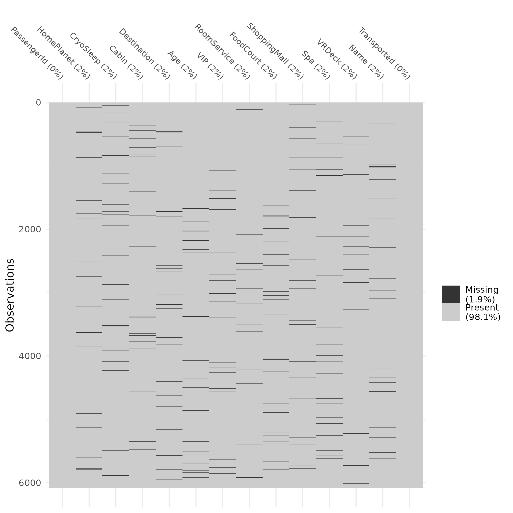

*** Investigando Valores Duplicados
Através da contagem, podemos verificar a ausência de valores duplicados.

#+name: eda-data--duplicates
#+begin_src R :session *R* :results output :tangle eda.r
# Computar duplicatas no dataset de treinamento
train_duplicates     <- sum(duplicated(train_data) | duplicated(train_data, fromLast = TRUE))
train_duplicates_pct <- round(100 * train_duplicates / nrow(train_data), 2)

# ... e de teste
test_duplicates      <- sum(duplicated(test_data) | duplicated(test_data, fromLast = TRUE))
test_duplicates_pct  <- round(100 * test_duplicates / nrow(test_data), 2)

# produzir dataframe para os dados obtidos
df_duplicates <- data.frame(
  `Treino (abs)` = train_duplicates,
  `Treino (%)`   = train_duplicates_pct,
  `Teste (abs)`  = test_duplicates,
  `Teste (%)`    = test_duplicates_pct,
  check.names    = FALSE
)

cat("Linhas duplicadas (todas as ocorrências):\n")
print(df_duplicates, row.names = FALSE)
#+end_src

#+RESULTS: eda-data--duplicates
: Linhas duplicadas (todas as ocorrências):
: Treino (abs) Treino (%) Teste (abs) Teste (%)
:             0          0           0         0

** Análise das /Features/
*** Separando Colunas Numéricas e Categóricas
#+eda-features--separating
#+begin_src R :session *R* :results output :tangle eda.r
# Extração dos nomes das colunas categóricas e numéricas
column_types <- tibble(
  feature  = names(train_data),
  datatype = map_chr(train_data, ~ class(.)[1]),
  category = case_when(
    map_lgl(train_data, is.numeric) ~ "numerica",

    map_lgl(train_data, ~
                          is.character(.) ||
                          is.factor(.)    ||
                          is.logical(.)
            )                       ~ "categorica",

    map_lgl(train_data, ~
                          inherits(., "Date") ||
                          inherits(., "POSIXct")
            )                       ~ "temporal"
    ),

  missing  = map_int(train_data, ~ sum(is.na(.))),
  unique   = map_int(train_data, n_distinct)
  )

column_types

# Extração dos nomes de colunas por tipo
column_names_by_type <- column_types %>% 
  split(.$category) %>% 
  map(~ .x$feature)
#+end_src

#+RESULTS:
#+begin_example
# A tibble: 14 × 5
   feature      datatype  category   missing unique
   <chr>        <chr>     <chr>        <int>  <int>
 1 PassengerId  character categorica       0   6085
 2 HomePlanet   character categorica     149      4
 3 CryoSleep    logical   categorica     147      3
 4 Cabin        character categorica     138   4853
 5 Destination  character categorica     139      4
 6 Age          numeric   numerica       123     81
 7 VIP          logical   categorica     144      3
 8 RoomService  numeric   numerica       129   1022
 9 FoodCourt    numeric   numerica       134   1188
10 ShoppingMall numeric   numerica       133    913
11 Spa          numeric   numerica       128   1052
12 VRDeck       numeric   numerica       133   1030
13 Name         character categorica     144   5930
14 Transported  logical   categorica       0      2
#+end_example

A partir da tabela acima, sabemos que
- as colunas =HomePlanet=, =CryoSleep=, =Destination= e =VIP= são verdadeiramente categóricas, apresentando $3$ ou $4$ valores;
- a coluna =Name= é descrita como categórica porque seu /data type/ é =character= (isto é, /string/).

*** Análise das Colunas Numéricas
**** Histogramas
A fim de investigar /outliers/ e a distribuição dos valores numéricos, vamos criar histogramas para todas as /features/ desta natureza. Em seguida, vamos usar a biblioteca =patchwork= para compôr os gráficos em uma visualização única.

#+eda-features--numerical-histograms
#+begin_src R :session *R* :results silent :tangle eda.r
# Extrair os nomes das colunas numéricas
num_vars <- column_types %>% 
  filter(category == "numerica") %>% 
  pull(feature)

# Criar e salvar cada histograma individualmente usando purrr::map
lista_plots <- map(num_vars, function(col_name) {
  # Nomear o gráfico
  filepath = paste0("data/visualizations/histogram--", col_name, ".png")
  cat("Gerando `", filepath, "`...", sep="")
  
  # Criar o gráfico dinamicamente
  p <- ggplot(train_data, aes(x = .data[[col_name]])) +
    geom_histogram(fill = "steelblue", color = "white", bins = 20) +
    theme_minimal() +
    labs(
      title = col_name,
      x = col_name,
      y = "Frequência"
    )
  
  # Salvar o gráfico individual
  ggsave(
    filename = filepath,
    plot     = p
  )
  
  return(p) # Retorna o objeto do gráfico para a lista
})

# Compôr os histogramas com patchwork
composition <- wrap_plots(lista_plots, ncol = 3) + 
  plot_annotation(
    title = "Histogramas das Features Numéricas",
    theme = theme(plot.title = element_text(size = 16, face = "bold", hjust = 0.5))
  )

cat("Gerando composição de gráficos...")
ggsave(filename=paste0(PATH_VIS, "histogram--composition.png"), plot=composition)
#+end_src

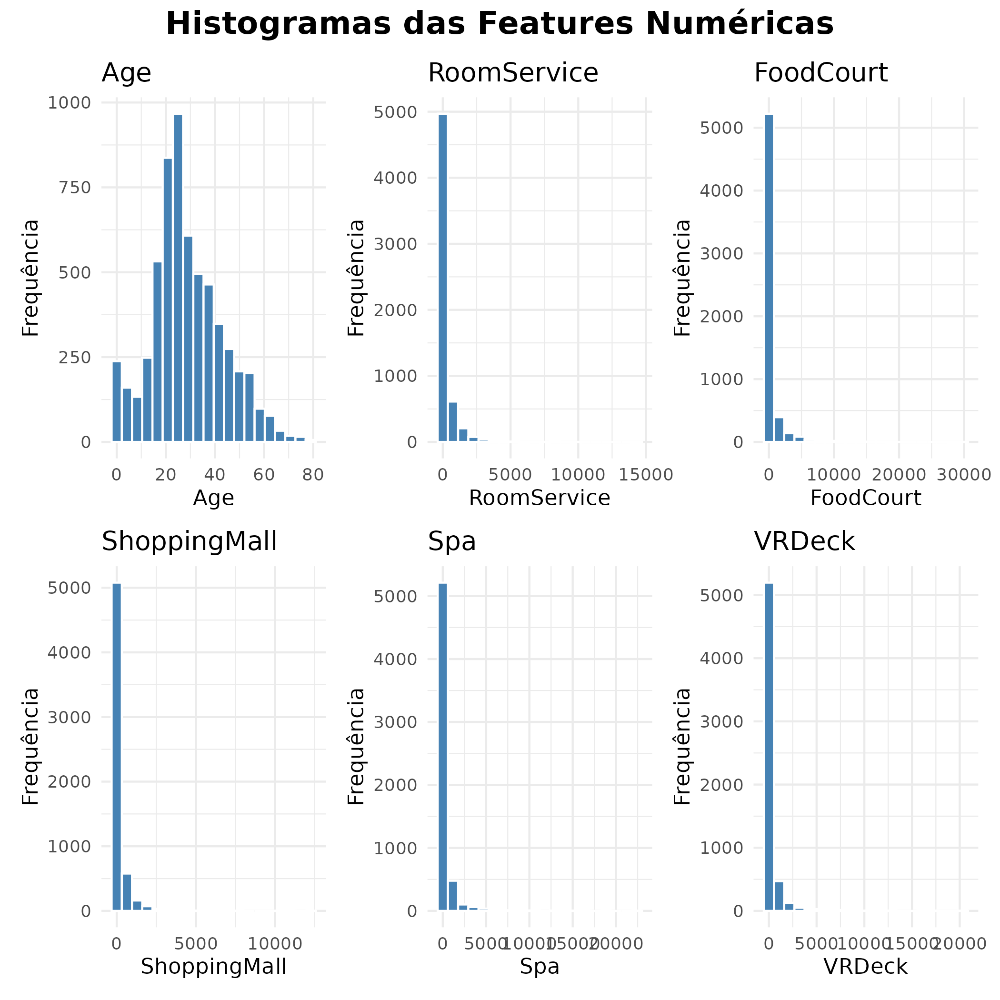

**** /Boxplots/ relacionando =Transported=
#+eda-features--numerical-boxplots
#+begin_src R :session *R* :results silent :tangle eda.r
lista_plots <- map(num_vars, function(col_name) {
  
  # Converter para numérico e remover NAs temporariamente para o cálculo do boxplot
  dados_plot <- train_data[!is.na(train_data[[col_name]]), ]
  dados_plot[[col_name]] <- as.numeric(dados_plot[[col_name]])
  
  # Criar o gráfico garantindo eixos explícitos
  p <- ggplot(dados_plot,
              aes(x = factor(Transported), y = .data[[col_name]], fill = factor(Transported))) +
              # outlier.shape = NA esconde os pontos gigantes que esmagam o gráfico
              geom_boxplot(outlier.shape = NA, width = 0.6) + 
              # Ajusta o zoom para focar onde a maioria dos dados está (95% centrais)
              coord_cartesian(ylim = quantile(dados_plot[[col_name]], c(0, 0.95), na.rm = TRUE)) +
              labs(
                title = paste0("Transported vs. ", col_name),
                x = "Transportado",
                y = "Valor"
              ) +
              theme_minimal(base_size = 9) + # Diminui o texto para caber no grid
              theme(legend.position = "none") # Remove legendas repetidas

  
  return(p)
})

# Compôr o grid com escalas livres para evitar distorção
composition <- wrap_plots(lista_plots, ncol = 2) + 
  plot_layout(guides = "collect") + # Junta as legendas se houver
  plot_annotation(
    title = "Boxplots: Features Numéricas vs. Transported",
    theme = theme(plot.title = element_text(size = 12, face = "bold", hjust = 0.5))
  )

cat("Gerando composição de gráficos...")
ggsave(filename=paste0(PATH_VIS, "boxplot--composition.png"), plot=composition)
#+end_src

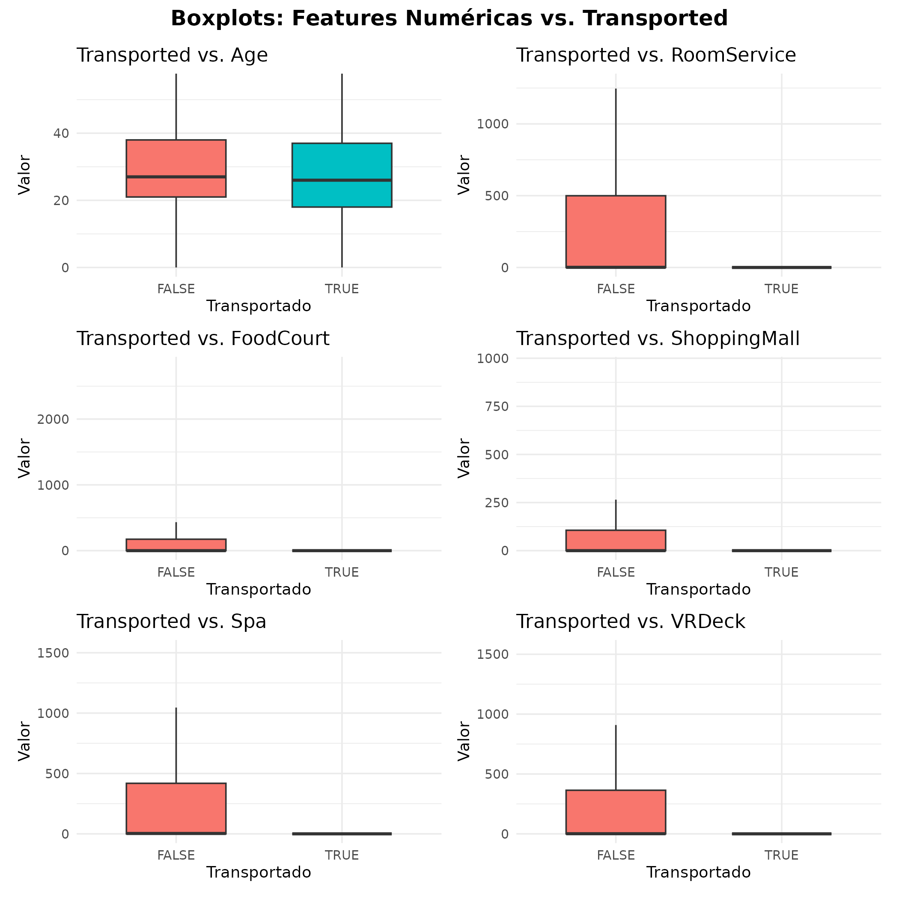

**** Distruições com Gráfico de Violino
#+eda-features--numerical-violins
#+begin_src R :session *R* :results silent :tangle eda.r
lista_plots <- map(num_vars, function(col_name) {
  
  dados_plot <- train_data[!is.na(train_data[[col_name]]), ]
  dados_plot[[col_name]] <- as.numeric(dados_plot[[col_name]])
  
  p <- ggplot(dados_plot,
              aes(x = factor(Transported), y = .data[[col_name]], fill = factor(Transported))) +
              # 1. Gráfico de violino mostra a distribuição/concentração mesmo se for zero
              geom_violin(alpha = 0.4, color = NA, scale = "width") +
              # 2. Adiciona os pontos reais levemente espalhados para ver a amostragem
              geom_jitter(aes(color = factor(Transported)), alpha = 0.1, width = 0.2) +
              # 3. Escala logarítmica + 1 para lidar com valores zero sem quebrar o gráfico
              scale_y_log10(labels = scales::label_comma()) +
              labs(
                title = paste0("vs. ", col_name),
                x = "Transportado",
                y = paste0(col_name, " (Log10)")
              ) +
              theme_minimal(base_size = 9) +
              theme(legend.position = "none")
  
  return(p)
})

# Recompor o layout com patchwork
composition <- wrap_plots(lista_plots, ncol = 2) + 
  plot_annotation(
    title = "Distribuição: Features Numéricas vs. Transported",
    theme = theme(plot.title = element_text(size = 12, face = "bold", hjust = 0.5))
  )

ggsave(filename="data/visualizations/distribution-violins.png", plot=composition)
#+end_src

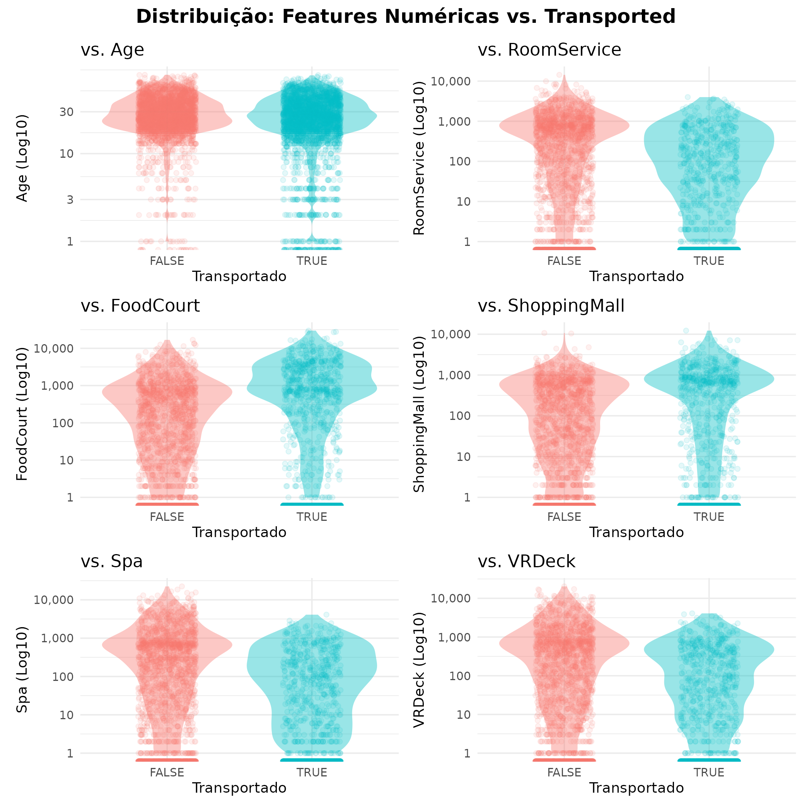

**** Boxplots para identificar outliers
#+eda-features--identifying-outliers
#+begin_src R :session *R* :results silent :tangle eda.r
dist <- train_data %>%
  select(Age, RoomService, FoodCourt, ShoppingMall, Spa, VRDeck) %>%
  pivot_longer(everything(), names_to = "variavel", values_to = "valor") %>%
  filter(!is.na(valor)) %>%          # remove NAs
  ggplot(aes(x = variavel, y = valor + 1)) +  # +1 permite log de zero
  geom_boxplot() +
  scale_y_log10() +
  labs(y = "valor + 1 (escala log10)", title = "Distribuição das variáveis numéricas")

print("Gerando boxplots para identificação de outliers...")
ggsave(filename="data/visualizations/distribution-outliers.png", plot=dist)
#+end_src

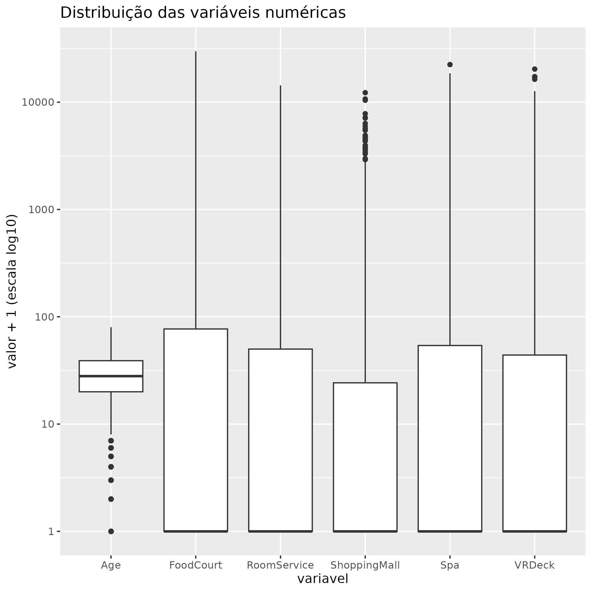

**** Densidade de =Age= estratificada por =Transported=
#+name: eda-features--density-Age-Transported
#+begin_src R :session *R* :results silente :tangle eda.r
density <- train_data %>%
  filter(!is.na(Age)) %>%
  ggplot(aes(x = Age, fill = Transported)) +
  geom_density(alpha = 0.5, na.rm = TRUE) +
  theme_minimal()

print("Gerando gráfico de densidade entre Age e Transported...")
ggsave(filename="data/visualizations/density--Age-Transported.png", plot=density)
#+end_src

#+RESULTS: eda-features--density-Age-Transported
: data/visualizations/density--Age-Transported.png

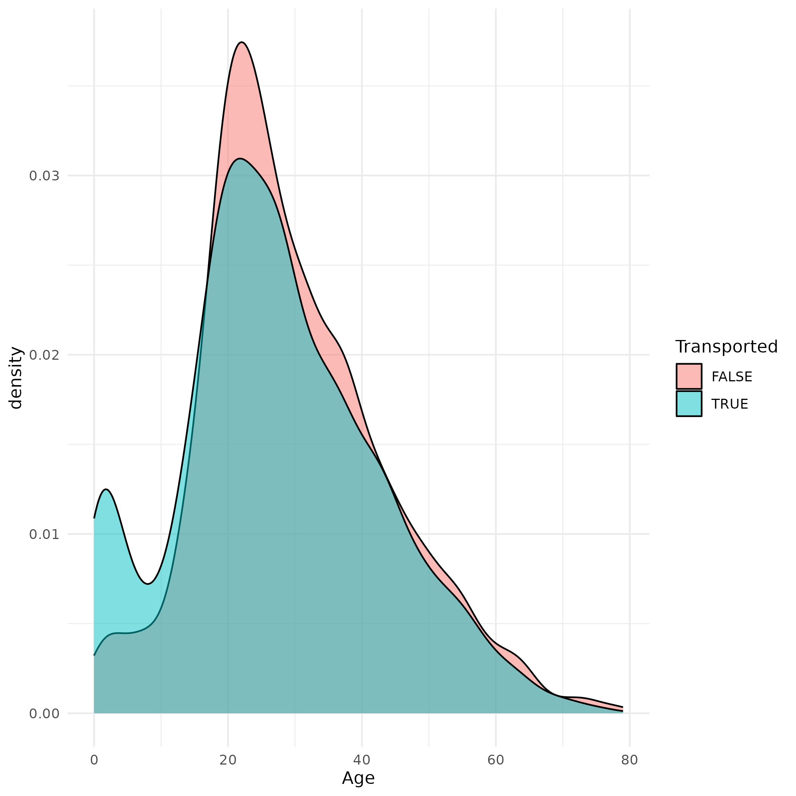

*** Análise Univariada para Variáveis Categóricas
Gráfico de barras para =HomePlanet=, =CryoSleep=, =Destination= e =VIP=.

#+name: eda-features--barplots-categorical
#+begin_src R :session *R* :results silent :tangle eda.r
dist_cat <- train_data %>%
  select(HomePlanet, CryoSleep, Destination, VIP, Transported) %>%
  mutate(
    CryoSleep = as.character(CryoSleep),
    VIP = as.character(VIP)
  ) %>%
  pivot_longer(-Transported, names_to = "variavel", values_to = "categoria") %>%
  filter(!is.na(categoria)) %>%
  ggplot(aes(x = categoria, fill = Transported)) +
  geom_bar(position = "fill") +
  facet_wrap(~variavel, scales = "free_x") +
  theme_minimal() +
  labs(y = "Proporção", title = "Relação entre variáveis categóricas e Transported")

print("Gerando barplots para features categóricas...")
ggsave(filename="data/visualizations/barplots--Transported-vs-Categorical_Features.png",
       plot = dist_cat)
#+end_src

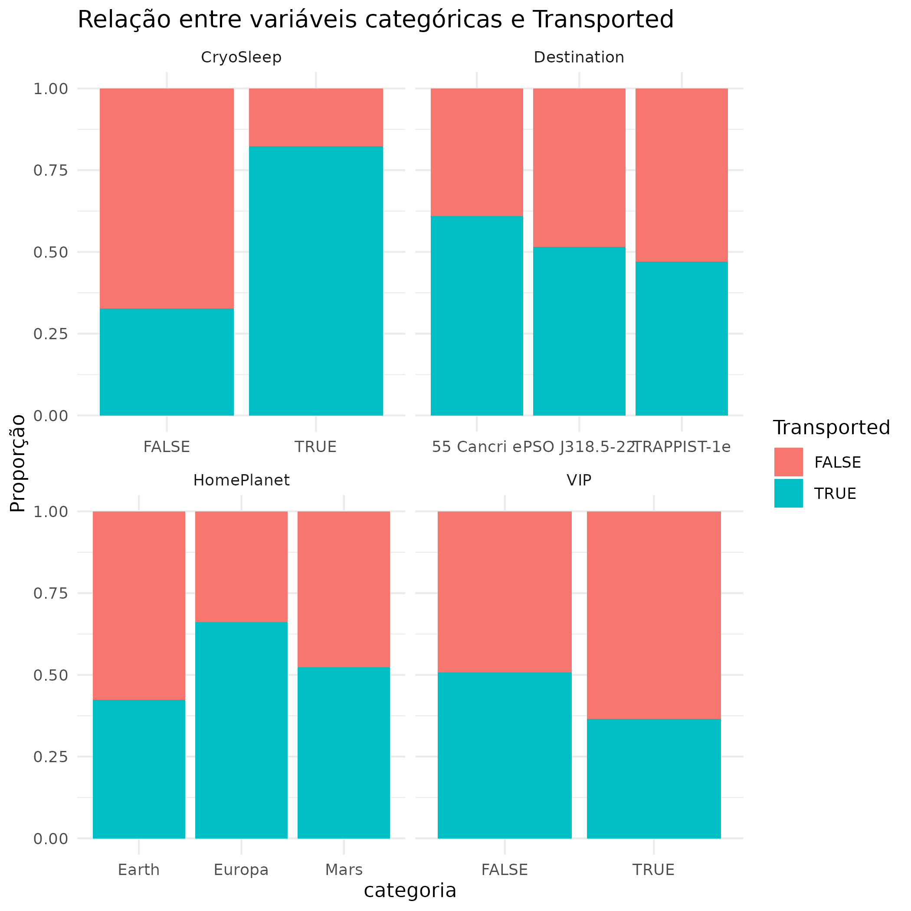

*** Análise Bivariada
**** Exploração da coluna Cabin
#+name: eda-features--bivariate-cabin-deck-analysis
#+begin_src R :session *R* :results silent :tangle eda.r
cabin_data <- train_data %>%
  filter(!is.na(Cabin)) %>%
  mutate(deck = substr(Cabin, 1, 1)) %>%
  count(deck, Transported) %>%
  ggplot(aes(x = deck, y = n, fill = Transported)) +
  geom_col(position = "dodge") +
  theme_minimal()

print("Gerando análise bivariada para CabinDeck...")
ggsave(filename="data/visualizations/bivariate-analysis--cabin-deck.png",
       plot = cabin_data)
#+end_src

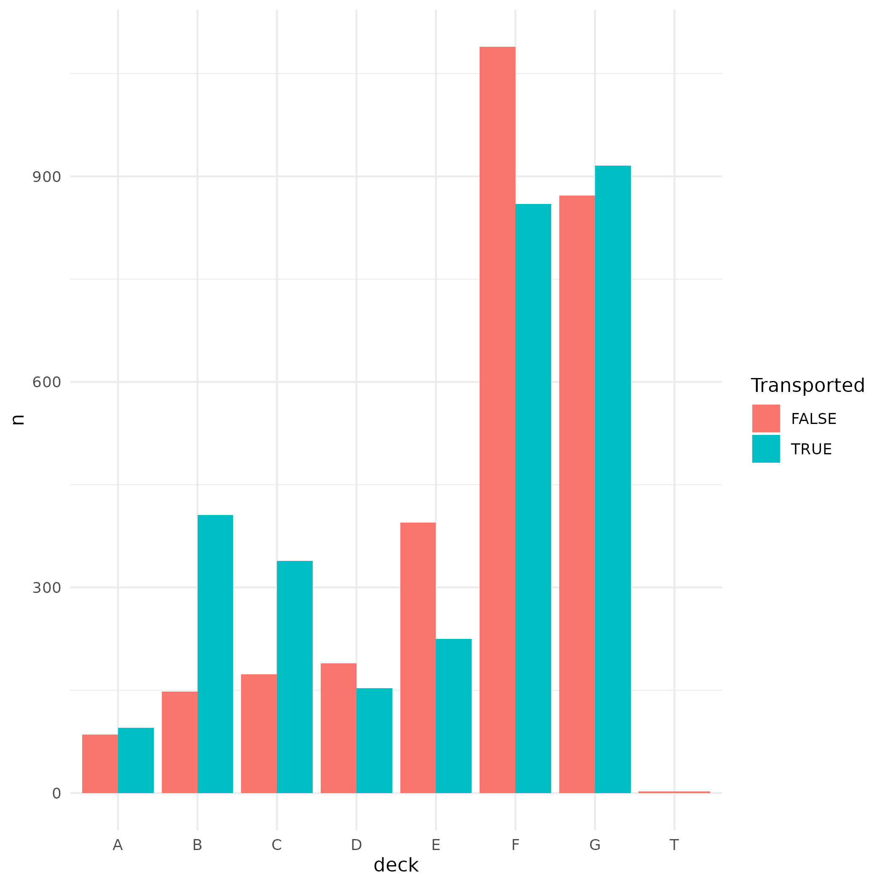

* Engenharia de /Features/
** Adicionando /Features/
**** Definição das /Features/ =Expenditure= e =NoExpenditure=
A coluna =Expenditure= *agrupa* em si aditivamente os valores de custos dos tripulantes.
#+name: eda-feat-eng--Expenditure-definition
#+begin_src R :session *R* :results output silent :tangle eda.r
# Modificando os dados de treinamento para incluir =Expenditure=
train_data <- train_data %>%
  mutate(
    Expenditure = RoomService + FoodCourt + ShoppingMall + Spa + VRDeck,
  )

test_data <- test_data %>%
  mutate(
    Expenditure = RoomService + FoodCourt + ShoppingMall + Spa + VRDeck,
  )

# Incluindo =NoExpenditure=
train_data <- train_data %>%
  mutate(NoExpenditure = as.integer(Expenditure == 0))

test_data <- test_data %>%
  mutate(NoExpenditure = as.integer(Expenditure == 0))
#+end_src

#+name: eda-feat-eng--Expenditure-visualization
#+begin_src R :session *R* :results output silent :tangle eda.r
# Composição de gráficos para visualização da nova feature =Expenditure=
# 1. Histograma da despesa total
p_hist <- ggplot(train_data, aes(x = Expenditure)) +
  geom_histogram(fill = "steelblue", color = "white", bins = 40, alpha = 0.7) +
  scale_x_log10(labels = scales::comma) +  # escala log devido à assimetria
  labs(
    title = "Distribuição de Expenditure",
    x = "Gasto Total (escala log)",
    y = "Frequência"
  ) +
  theme_minimal()

# 2. Boxplot da despesa por status de transporte
p_box <- ggplot(train_data, aes(x = factor(Transported), y = Expenditure, fill = factor(Transported))) +
  geom_boxplot(alpha = 0.7, outlier.size = 0.8) +
  scale_y_log10(labels = scales::comma) +
  labs(
    title = "Expenditure por Transported",
    x = "Transportado",
    y = "Gasto Total (escala log)",
    fill = "Transportado"
  ) +
  theme_minimal() +
  theme(legend.position = "none")

# 3. Densidade (KDE) comparativa
p_density <- ggplot(train_data, aes(x = Expenditure, fill = factor(Transported))) +
  geom_density(alpha = 0.5) +
  scale_x_log10(labels = scales::comma) +
  labs(
    title = "Densidade de Expenditure por Classe",
    x = "Gasto Total (escala log)",
    y = "Densidade",
    fill = "Transportado"
  ) +
  theme_minimal()

# 4. Gráfico de barras para passageiros com gasto zero vs positivo
p_bar <- ggplot(train_data, aes(x = factor(NoExpenditure), fill = factor(Transported))) +
  geom_bar(position = "fill") +
  scale_y_continuous(labels = scales::percent) +
  scale_fill_manual(values = c("#E69F00", "#56B4E9")) +
  scale_x_discrete(labels = c("0" = "Com gastos", "1" = "Sem gastos")) +
  labs(title = "Proporção de Transportados por\nAusência de Gastos (NoExpenditure)",
       x = "",
       y = "Proporção") +
  theme_minimal()

# Combinar os gráficos em uma grade 2x2
composition <- (p_hist + p_box) / (p_density + p_bar) +
  plot_annotation(
    title = "Análise da Feature 'Expenditure'",
    theme = theme(plot.title = element_text(hjust = 0.5, size = 16, face = "bold"))
  )

# Salvar a composição
print("Gerando composição de gráficos da nova feature (Expenditure)...")
ggsave(filename = "data/visualizations/composition--Expenditure.png",
       plot = composition,
       width = 12, height = 10, dpi = 150)

# Gráfico 1: Contagem absoluta (barras lado a lado)
p_count <- ggplot(train_data, aes(x = factor(NoExpenditure), fill = factor(Transported))) +
  geom_bar(position = "dodge", alpha = 0.8) +
  scale_fill_manual(values = c("#E69F00", "#56B4E9"), 
                    name = "Transportado",
                    labels = c("Não", "Sim")) +
  scale_x_discrete(labels = c("0" = "Teve gastos", "1" = "Sem gastos")) +
  labs(title = "Contagem de passageiros por gasto zero",
       x = "No_spending (ausência de gastos)",
       y = "Contagem") +
  theme_minimal()

# Gráfico 2: Proporção dentro de cada categoria de No_spending (barras empilhadas 100%)
p_prop <- ggplot(train_data, aes(x = factor(NoExpenditure), fill = factor(Transported))) +
  geom_bar(position = "fill") +
  scale_y_continuous(labels = scales::percent) +
  scale_fill_manual(values = c("#E69F00", "#56B4E9"), 
                    name = "Transportado",
                    labels = c("Não", "Sim")) +
  scale_x_discrete(labels = c("0" = "Teve gastos", "1" = "Sem gastos")) +
  labs(title = "Proporção de transportados por ausência de gastos",
       x = "No_spending (ausência de gastos)",
       y = "Proporção") +
  theme_minimal()

# Combinar os dois gráficos lado a lado
composition_no_spending <- p_count + p_prop +
  plot_annotation(
    title = "Análise da Feature 'NoExpenditure'",
    theme = theme(plot.title = element_text(hjust = 0.5, size = 14, face = "bold"))
  )

# Salvar
print("Gerando composição de gráficos para feature 'NoExpenditure'...")
ggsave("data/visualizations/composition--NoExpenditure.png",
       plot = composition_no_spending, width = 12, height = 5, dpi = 150)
#+end_src

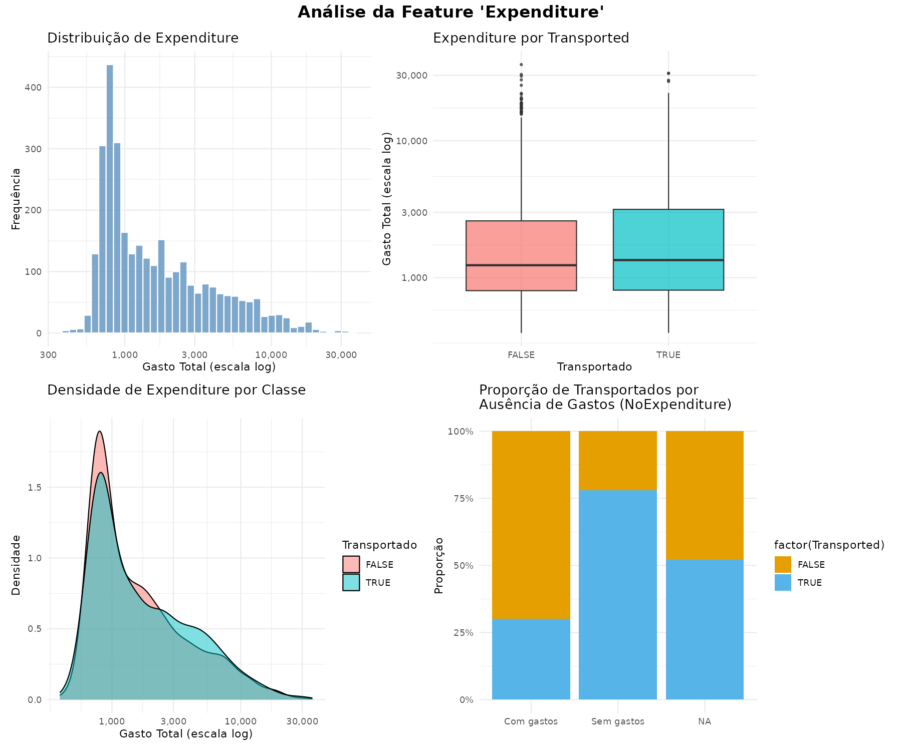

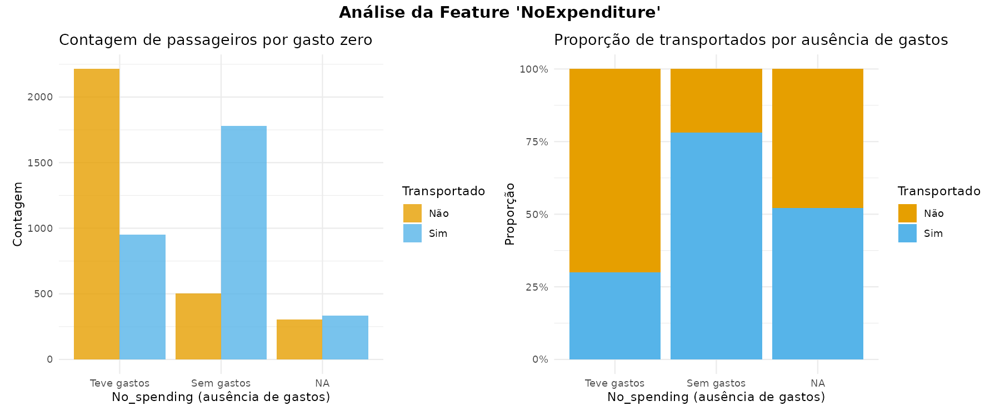

**** Definição de /Feature/ =Age_Group=
Podemos discretizar a variação de idades do /dataset/ em grupos bem-definidos. Em seguida, veremos como essa discretização se reflete sobre nossa /target/.

#+name: eda-feat-eng--Age_Group-definition
#+begin_src R :session *R* :results output silent :tangle eda.r
add_age_group <- function(df) {
  df %>%
    mutate(
      Age_Group = case_when(
        Age <= 12                     ~ "Age_0-12",
        Age > 12  & Age < 18          ~ "Age_13-17",
        Age >= 18 & Age <= 25         ~ "Age_18-25",
        Age > 25  & Age <= 30         ~ "Age_26-30",
        Age > 30  & Age <= 50         ~ "Age_31-50",
        Age > 50                      ~ "Age_51+",
        TRUE                          ~ NA_character_
      ),
      # Garantir que seja um fator com ordem correta
      Age_Group = factor(Age_Group, 
                         levels = c("Age_0-12", "Age_13-17", "Age_18-25",
                                    "Age_26-30", "Age_31-50", "Age_51+"))
    )
}

# Aplicar aos dados de treino e teste
train_data <- add_age_group(train_data)
test_data  <- add_age_group(test_data)
#+end_src

#+name: eda-feat-eng--Age_Group-visualization
#+begin_src R :session *R* :results output silent :tangle eda.r
# 1. Gráfico de barras (contagem absoluta) com hue = Transported
p1 <- ggplot(train_data, aes(x = Age_Group, fill = factor(Transported))) +
  geom_bar(position = "dodge", alpha = 0.8) +
  scale_fill_manual(values = c("#E69F00", "#56B4E9"), 
                    name = "Transportado",
                    labels = c("Não", "Sim")) +
  labs(
    title = "Distribuição dos Grupos Etários por Status de Transporte",
    x = "Grupo de Idade",
    y = "Contagem"
  ) +
  theme_minimal() +
  theme(axis.text.x = element_text(angle = 45, hjust = 1))

# 2. Gráfico de barras normalizado (proporção dentro de cada grupo)
p2 <- ggplot(train_data, aes(x = Age_Group, fill = factor(Transported))) +
  geom_bar(position = "fill", alpha = 0.8) +
  scale_y_continuous(labels = scales::percent) +
  scale_fill_manual(values = c("#E69F00", "#56B4E9"), 
                    name = "Transportado",
                    labels = c("Não", "Sim")) +
  labs(
    title = "Proporção de Transportados por Grupo Etário",
    x = "Grupo de Idade",
    y = "Proporção"
  ) +
  theme_minimal() +
  theme(axis.text.x = element_text(angle = 45, hjust = 1))

# 3. Boxplot da idade por grupo (para validar a categorização)
p3 <- ggplot(train_data, aes(x = Age_Group, y = Age, fill = factor(Transported))) +
  geom_boxplot(alpha = 0.7, outlier.size = 0.8) +
  scale_fill_manual(values = c("#E69F00", "#56B4E9"), 
                    name = "Transportado") +
  labs(
    title = "Distribuição da Idade por Grupo e Transporte",
    x = "Grupo de Idade",
    y = "Idade"
  ) +
  theme_minimal() +
  theme(axis.text.x = element_text(angle = 45, hjust = 1))

# 4. Gráfico de densidade da idade, destacando os grupos (facetado por Transported)
p4 <- ggplot(train_data, aes(x = Age, fill = Age_Group)) +
  geom_density(alpha = 0.6) +
  facet_wrap(~ Transported, labeller = labeller(Transported = c("TRUE" = "Transportado", "FALSE" = "Não transportado"))) +
  scale_fill_viridis_d() +
  labs(
    title = "Densidade da Idade por Grupo Etário e Status de Transporte",
    x = "Idade",
    y = "Densidade",
    fill = "Grupo de Idade"
  ) +
  theme_minimal()

# Combinar gráficos em uma grade 2x2
composition <- (p1 + p2) / (p3 + p4) +
  plot_annotation(
    title = "Análise da Feature 'Age_Group'",
    theme = theme(plot.title = element_text(hjust = 0.5, size = 16, face = "bold"))
  )

# Salvar a composição
print("Gerando composição de gráficos para feature Age_Group...")
ggsave("data/visualizations/composition--Age_Group.png", 
       plot = composition, width = 14, height = 10, dpi = 150)
#+end_src

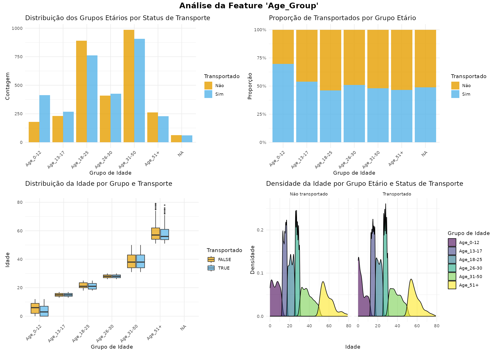

**** Definição das /Features/ =Group= e =Group_Size=
A partir de =PassagerId=, podemos extrair a qual /grupo/ pertence um passageiro. Contando a quantidade de pessoas por grupo, podemos saber os tamanhos dos grupos.

#+name: eda-feat-eng--Groups-definition
#+begin_src R :session *R* :results output silent :tangle eda.r
# 1. Extrair 'Group' do PassengerId (antes do underscore)
train_data <- train_data %>%
  mutate(Group = as.integer(str_extract(PassengerId, "^[^_]+")))

test_data <- test_data %>%
  mutate(Group = as.integer(str_extract(PassengerId, "^[^_]+")))

# 2. Calcular 'Group_Size' usando contagem combinada de treino e teste
#    (mesma lógica do value_counts() em pandas)
combined_counts <- bind_rows(
  train_data %>% select(Group),
  test_data %>% select(Group)
) %>%
  count(Group, name = "Group_Size")

# Adicionar Group_Size aos dados de treino e teste via left_join
train_data <- train_data %>%
  left_join(combined_counts, by = "Group")

test_data <- test_data %>%
  left_join(combined_counts, by = "Group")
#+end_src

#+name: eda-feat-eng--Groups-visualization
#+begin_src R :session *R* :results output silent :tangle eda.r
# Gráfico 1: Histograma de Group (binwidth=1, hue=Transported)
p1 <- ggplot(train_data, aes(x = Group, fill = factor(Transported))) +
  geom_histogram(binwidth = 1, alpha = 0.7, position = "identity") +
  scale_fill_manual(values = c("#E69F00", "#56B4E9"), 
                    name = "Transportado",
                    labels = c("Não", "Sim")) +
  labs(title = "Group", x = "Grupo", y = "Contagem") +
  theme_minimal()

# Gráfico 2: Gráfico de barras (countplot) de Group_size, hue=Transported
p2 <- ggplot(train_data, aes(x = as.factor(Group_Size), fill = factor(Transported))) +
  geom_bar(position = "dodge", alpha = 0.8) +
  scale_fill_manual(values = c("#E69F00", "#56B4E9"), 
                    name = "Transportado",
                    labels = c("Não", "Sim")) +
  labs(title = "Group Size", x = "Tamanho do Grupo", y = "Contagem") +
  theme_minimal() +
  theme(axis.text.x = element_text(angle = 45, hjust = 1))

# Combinar os dois gráficos lado a lado (layout 1x2)
composition <- p1 + p2 +
  plot_annotation(
    title = "Distribuição das Features 'Group' e 'Group_Size'",
    theme = theme(plot.title = element_text(hjust = 0.5, size = 14, face = "bold"))
  )

# Salvar a composição (opcional)
if (!dir.exists("data/visualizations")) dir.create("data/visualizations", recursive = TRUE)
ggsave("data/visualizations/composition--Group_Group_Size.png", 
       plot = composition, width = 12, height = 5, dpi = 150)
#+end_src

**** Definição da /Feature/ =Alone=
Se o =Group_Size= ao qual pertence um passageiro é =1=, então o passageiro está viajando sozinho.

#+name: eda-feat-eng--Alone-definition
#+begin_src R :session *R* :results output silent :tangle eda.r
# Para o conjunto de treino
train_data <- train_data %>%
  mutate(Alone = as.integer(Group_Size == 1))

# Para o conjunto de teste
test_data <- test_data %>%
  mutate(Alone = as.integer(Group_Size == 1))
#+end_src

#+name: eda-feat-eng--Alone-visualization
#+begin_src R :session *R* :results output silent :tangle eda.r
# Gráfico 1: Barras lado a lado (contagem absoluta)
p1 <- ggplot(train_data, aes(x = factor(Alone), fill = factor(Transported))) +
  geom_bar(position = "dodge", alpha = 0.8) +
  scale_fill_manual(values = c("#E69F00", "#56B4E9"), 
                    name = "Transportado",
                    labels = c("Não", "Sim")) +
  scale_x_discrete(labels = c("0" = "Em grupo", "1" = "Sozinho")) +
  labs(title = "Contagem de passageiros viajando sozinhos ou em grupo",
       x = "Alone (viaja sozinho?)",
       y = "Contagem") +
  theme_minimal()

# Gráfico 2: Barras empilhadas (proporção dentro de cada categoria)
p2 <- ggplot(train_data, aes(x = factor(Alone), fill = factor(Transported))) +
  geom_bar(position = "fill") +
  scale_y_continuous(labels = scales::percent) +
  scale_fill_manual(values = c("#E69F00", "#56B4E9"), 
                    name = "Transportado",
                    labels = c("Não", "Sim")) +
  scale_x_discrete(labels = c("0" = "Em grupo", "1" = "Sozinho")) +
  labs(title = "Proporção de transportados por condição de viagem",
       x = "Alone (viaja sozinho?)",
       y = "Proporção") +
  theme_minimal()

# Combinar os dois gráficos lado a lado
composition_alone <- p1 + p2 +
  plot_annotation(
    title = "Análise da Feature 'Alone'",
    theme = theme(plot.title = element_text(hjust = 0.5, size = 14, face = "bold"))
  )

# Salvar a composição
print("Gerando composição de gráficos para feature 'Alone'...")
ggsave("data/visualizations/composition--Alone.png",
       plot = composition_alone, width = 12, height = 5, dpi = 150)
#+end_src

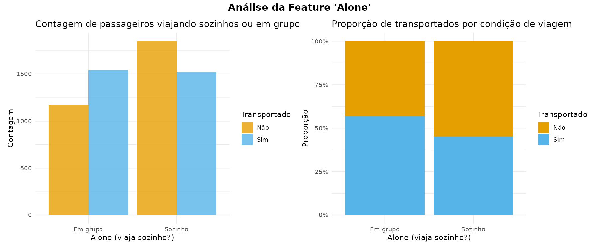

**** Definição de /Features/ baseadas em =Cabin=: =Cabin_Deck=, =Cabin_Number=, =Cabin_Side= e =Cabin_RegionX=
Podemos analiar a /feature/ =Cabin= em três outras /features/ distintas.

#+name: eda-feat-eng--Cabin_Features-definition
#+begin_src R :session *R* :results output silent :tangle eda.r
# Substituir NA por um placeholder para permitir split
train_data <- train_data %>%
  mutate(Cabin = tidyr::replace_na(Cabin, "Z/9999/Z"))

test_data <- test_data %>%
  mutate(Cabin = tidyr::replace_na(Cabin, "Z/9999/Z"))

# Dividir a string Cabin em três componentes
train_data <- train_data %>%
  tidyr::separate(Cabin, into = c("Cabin_Deck", "Cabin_Number", "Cabin_Side"), 
                  sep = "/", remove = FALSE) %>%
  mutate(Cabin_Number = as.integer(Cabin_Number))

test_data <- test_data %>%
  tidyr::separate(Cabin, into = c("Cabin_Deck", "Cabin_Number", "Cabin_Side"), 
                  sep = "/", remove = FALSE) %>%
  mutate(Cabin_Number = as.integer(Cabin_Number))

# Recolocar NA nos placeholders
train_data <- train_data %>%
  mutate(Cabin_Deck   = if_else(Cabin_Deck == "Z",   NA_character_, Cabin_Deck),
         Cabin_Number = if_else(Cabin_Number == 9999, NA_integer_,  Cabin_Number),
         Cabin_Side   = if_else(Cabin_Side == "Z",   NA_character_, Cabin_Side))

test_data <- test_data %>%
  mutate(Cabin_Deck   = if_else(Cabin_Deck == "Z",   NA_character_, Cabin_Deck),
         Cabin_Number = if_else(Cabin_Number == 9999, NA_integer_,  Cabin_Number),
         Cabin_Side   = if_else(Cabin_Side == "Z",   NA_character_, Cabin_Side))

# Remover coluna Cabin original (não mais necessária)
train_data <- train_data %>% select(-Cabin)
test_data  <- test_data  %>% select(-Cabin)

# Criar regiões da cabine com base no número (Cabin_number)
# Bins: [0,300), [300,600), [600,900), [900,1200), [1200,1500), [1500,1800), [1800, Inf)
train_data <- train_data %>%
  mutate(
    Cabin_Region1 = as.integer(Cabin_Number < 300),
    Cabin_Region2 = as.integer(Cabin_Number >= 300 & Cabin_Number < 600),
    Cabin_Region3 = as.integer(Cabin_Number >= 600 & Cabin_Number < 900),
    Cabin_Region4 = as.integer(Cabin_Number >= 900 & Cabin_Number < 1200),
    Cabin_Region5 = as.integer(Cabin_Number >= 1200 & Cabin_Number < 1500),
    Cabin_Region6 = as.integer(Cabin_Number >= 1500 & Cabin_Number < 1800),
    Cabin_Region7 = as.integer(Cabin_Number >= 1800)
  )

test_data <- test_data %>%
  mutate(
    Cabin_Region1 = as.integer(Cabin_Number < 300),
    Cabin_Region2 = as.integer(Cabin_Number >= 300 & Cabin_Number < 600),
    Cabin_Region3 = as.integer(Cabin_Number >= 600 & Cabin_Number < 900),
    Cabin_Region4 = as.integer(Cabin_Number >= 900 & Cabin_Number < 1200),
    Cabin_Region5 = as.integer(Cabin_Number >= 1200 & Cabin_Number < 1500),
    Cabin_Region6 = as.integer(Cabin_Number >= 1500 & Cabin_Number < 1800),
    Cabin_Region7 = as.integer(Cabin_Number >= 1800)
  )

print("Features geradas a partir de 'Cabin': 'Cabin_Deck', 'Cabin_Number', 'Cabin_Side', 'Cabin_RegionX'")
#+end_src

#+name: eda-feat-eng--Cabin_Features-visualization
#+begin_src R :session *R* :results output silent :tangle eda.r
# 1. Gráfico de barras para Cabin_deck (ordem A-G, T)
deck_order <- c("A", "B", "C", "D", "E", "F", "G", "T")
p_deck <- ggplot(train_data, aes(x = factor(Cabin_Deck, levels = deck_order), 
                                  fill = factor(Transported))) +
  geom_bar(position = "dodge", alpha = 0.8) +
  scale_fill_manual(values = c("#E69F00", "#56B4E9"), 
                    name = "Transportado",
                    labels = c("Não", "Sim")) +
  labs(title = "Cabin Deck", x = "Deck", y = "Contagem") +
  theme_minimal() +
  theme(axis.text.x = element_text(angle = 0))

# 2. Histograma de Cabin_number com hue = Transported
p_number <- ggplot(train_data, aes(x = Cabin_Number, fill = factor(Transported))) +
  geom_histogram(binwidth = 20, alpha = 0.7, position = "identity") +
  scale_fill_manual(values = c("#E69F00", "#56B4E9"), 
                    name = "Transportado",
                    labels = c("Não", "Sim")) +
  geom_vline(xintercept = seq(300, 1800, by = 300), color = "black", linetype = "solid") +
  coord_cartesian(xlim = c(0, 2000)) +
  labs(title = "Cabin Number", x = "Número da Cabine", y = "Contagem") +
  theme_minimal()

# 3. Gráfico de barras para Cabin_side
p_side <- ggplot(train_data, aes(x = Cabin_Side, fill = factor(Transported))) +
  geom_bar(position = "dodge", alpha = 0.8) +
  scale_fill_manual(values = c("#E69F00", "#56B4E9"), 
                    name = "Transportado",
                    labels = c("Não", "Sim")) +
  labs(title = "Cabin Side", x = "Lado", y = "Contagem") +
  theme_minimal() +
  theme(axis.text.x = element_text(angle = 0))

# Empilhar os três primeiros gráficos verticalmente
top_plot <- (p_deck / p_number / p_side) +
  plot_annotation(title = "Análise das features derivadas de Cabin (Deck, Número, Lado)")

# 4. Gráfico para as regiões da cabine (criar variável combinada)
train_data <- train_data %>%
  mutate(Cabin_regions_plot = Cabin_Region1 * 1 +
                             Cabin_Region2 * 2 +
                             Cabin_Region3 * 3 +
                             Cabin_Region4 * 4 +
                             Cabin_Region5 * 5 +
                             Cabin_Region6 * 6 +
                             Cabin_Region7 * 7)

p_regions <- ggplot(train_data, aes(x = factor(Cabin_regions_plot), fill = factor(Transported))) +
  geom_bar(position = "dodge", alpha = 0.8) +
  scale_fill_manual(values = c("#E69F00", "#56B4E9"), 
                    name = "Transportado",
                    labels = c("Não", "Sim")) +
  labs(title = "Cabin regions (binas de número)", x = "Região", y = "Contagem") +
  theme_minimal() +
  theme(axis.text.x = element_text(angle = 0))

# Remover a coluna temporária (opcional, mas para não poluir o dataset)
train_data <- train_data %>% select(-Cabin_regions_plot)

# Salvar os gráficos individualmente ou em composição
print("Gerando composição de gráficos para features baseadas em 'Cabin'...")
ggsave("data/visualizations/cabin_deck_side_hist.png", 
       plot = top_plot, width = 8, height = 12, dpi = 150)
ggsave("data/visualizations/cabin_regions.png", 
       plot = p_regions, width = 8, height = 5, dpi = 150)
#+end_src

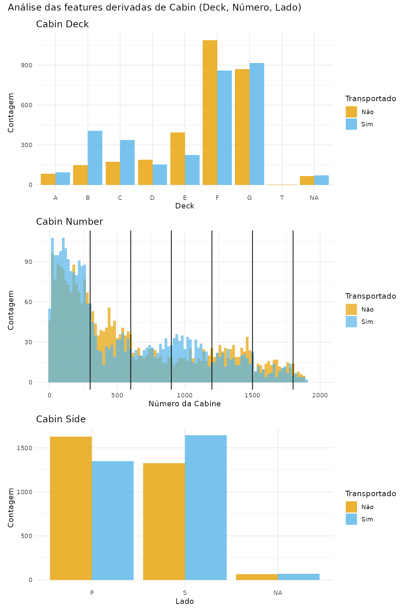
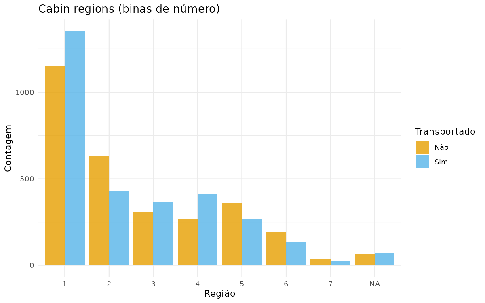

**** Definição de /Features/ a partir de =Name=: =Family=, =FamilySize=
#+name: eda-feat-eng--Family-definition
#+begin_src R :session *R* :results output silent :tangle eda.r
# 1. Substituir NA por placeholder "Unknown Unknown"
train_data <- train_data %>%
  mutate(Name = tidyr::replace_na(Name, "Unknown Unknown"))

test_data <- test_data %>%
  mutate(Name = tidyr::replace_na(Name, "Unknown Unknown"))

# 2. Extrair o sobrenome (última palavra do nome)
train_data <- train_data %>%
  mutate(Family = str_extract(Name, "\\S+$"))  # captura a última palavra

test_data <- test_data %>%
  mutate(Family = str_extract(Name, "\\S+$"))

# 3. Calcular Family_Size contando ocorrências do sobrenome em treino+teste
#    (mesma lógica do value_counts() no Python)
family_counts <- bind_rows(
  train_data %>% select(Family),
  test_data %>% select(Family)
) %>%
  count(Family, name = "Family_Size")

# Adicionar Family_Size aos dados
train_data <- train_data %>%
  left_join(family_counts, by = "Family")

test_data <- test_data %>%
  left_join(family_counts, by = "Family")

# 4. Recolocar NA nos placeholders (Unknown e valores > 100)
train_data <- train_data %>%
  mutate(
    Family = if_else(Family == "Unknown", NA_character_, Family),
    Family_Size = if_else(Family_Size > 100, NA_integer_, Family_Size)
  )

test_data <- test_data %>%
  mutate(
    Family = if_else(Family == "Unknown", NA_character_, Family),
    Family_Size = if_else(Family_Size > 100, NA_integer_, Family_Size)
  )

# 5. Remover a coluna original Name (não é mais necessária)
train_data <- train_data %>% select(-Name)
test_data  <- test_data  %>% select(-Name)
#+end_src

#+name: eda-feat-eng--Family-visualization
#+begin_src R :session *R* :results output silent :tangle eda.r
# Converter Family_Size para fator (para countplot)
p_family <- ggplot(train_data, aes(x = factor(Family_Size), fill = factor(Transported))) +
  geom_bar(position = "dodge", alpha = 0.8) +
  scale_fill_manual(values = c("#E69F00", "#56B4E9"), 
                    name = "Transportado",
                    labels = c("Não", "Sim")) +
  labs(title = "Family size", x = "Tamanho da família", y = "Contagem") +
  theme_minimal() +
  theme(axis.text.x = element_text(angle = 45, hjust = 1))

# Salvar o gráfico (opcional)
print("Gerando barplot para 'Family_Size'...")
ggsave("data/visualizations/family_size_distribution.png", 
       plot = p_family, width = 8, height = 5, dpi = 150)
#+end_src

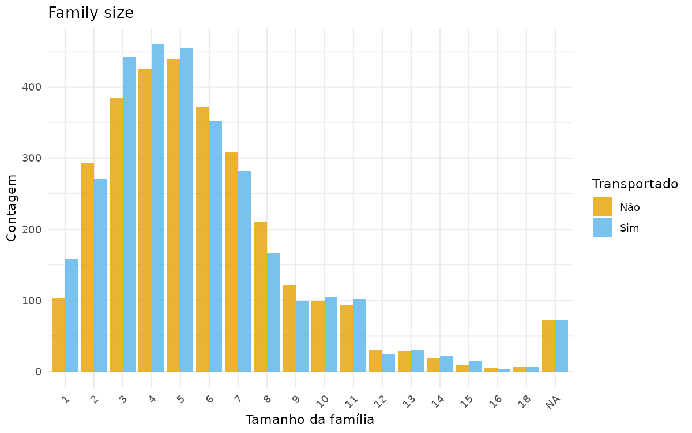

** Realizando Testes
*** =ttest=
#+name: eda-testing--ttest
#+begin_src R :session *R* :results output :tangle eda.r
perform_ttest <- function(train, feature_list, target) {
  # Cria um data.frame vazio para armazenar os resultados
  results <- data.frame(
    Feature = character(),
    t_stat  = numeric(),
    p_val   = numeric(),
    stringsAsFactors = FALSE
  )
  
  for (feat in feature_list) {
    # Constrói a fórmula: feature ~ target
    formula <- as.formula(paste(feat, "~", target))
    # Aplica o teste t com exclusão de NAs
    test <- t.test(formula, data = train, na.action = na.omit)
    
    # Adiciona os resultados
    results <- rbind(results, data.frame(
      Feature = feat,
      t_stat  = test$statistic,
      p_val   = test$p.value
    ))
  }
  
  # Exibe a tabela formatada (semelhante ao PrettyTable)
  print(knitr::kable(results, digits = 4, caption = "Resultados do teste t"))
}

cont_cols <- c("Age", "Expenditure", "RoomService", "FoodCourt", "ShoppingMall", "Spa", "VRDeck")

# Executar a função nos dados de treino
print("Aplicando ttest às features numéricas...");
perform_ttest(train_data, cont_cols, "Transported")
#+end_src

*** =ANOVA=
#+name: eda-testing--ANOVA
#+begin_src R :session *R* :results output :tangle eda.r
perform_anova <- function(train, feature_list, target) {
  # Cria um data.frame vazio para armazenar os resultados
  results <- data.frame(
    Feature = character(),
    F_statistic = numeric(),
    p_value = numeric(),
    stringsAsFactors = FALSE
  )
  
  for (feat in feature_list) {
    # Constrói a fórmula: feature ~ target
    formula <- as.formula(paste(feat, "~", target))
    # Ajusta o modelo linear e extrai a ANOVA (type I)
    model <- lm(formula, data = train, na.action = na.omit)
    anova_summary <- summary(aov(model))
    f_stat <- anova_summary[[1]]$`F value`[1]
    p_val  <- anova_summary[[1]]$`Pr(>F)`[1]
    
    # Adiciona os resultados
    results <- rbind(results, data.frame(
      Feature = feat,
      F_statistic = f_stat,
      p_value = p_val
    ))
  }
  
  # Exibe a tabela formatada
  print(knitr::kable(results, digits = 4, caption = "Resultados da ANOVA one-way"))
}

cont_cols <- c("Age", "Expenditure", "RoomService", "FoodCourt", 
               "ShoppingMall", "Spa", "VRDeck")

# Executar a função nos dados de treino
print("Aplicando ANOVA às features numéricas...")
perform_anova(train_data, cont_cols, "Transported")
#+end_src

** Imputação e Transformação de Dados
*** Imputando dados a partir das conclusões anteriores
#+name: eda-imputation--numerical
#+begin_src R :session *R* :results output :tangle eda.r
exp_features <- c(
  "RoomService",
  "FoodCourt",
  "ShoppingMall",
  "Spa",
  "VRDeck"
)

# Criar feature agregada de gastos de novo
train_data <- train_data %>%
  mutate(
    Expenditure = rowSums(
      across(all_of(exp_features)),
      na.rm = TRUE
    )
  )

test_data <- test_data %>%
  mutate(
    Expenditure = rowSums(
      across(all_of(exp_features)),
      na.rm = TRUE
    )
  )

# Imputar CryoSleep SOMENTE onde NA
train_data <- train_data %>%
  mutate(
    CryoSleep = case_when(
      !is.na(CryoSleep) ~ CryoSleep,
      Expenditure == 0 ~ TRUE,
      Expenditure > 0  ~ FALSE,
      TRUE ~ NA
    )
  )

test_data <- test_data %>%
  mutate(
    CryoSleep = case_when(
      !is.na(CryoSleep) ~ CryoSleep,
      Expenditure == 0 ~ TRUE,
      Expenditure > 0  ~ FALSE,
      TRUE ~ NA
    )
  )

# Ajustar gastos de passageiros em CryoSleep
train_data <- train_data %>%
  mutate(
    across(
      all_of(exp_features),
      ~ ifelse(CryoSleep == TRUE, 0, .x)
    )
  )

test_data <- test_data %>%
  mutate(
    across(
      all_of(exp_features),
      ~ ifelse(CryoSleep == TRUE, 0, .x)
    )
  )

# VIP: imputação conservadora
train_data <- train_data %>%
  mutate(
    VIP = case_when(
      !is.na(VIP) ~ VIP,
      Expenditure > quantile(Expenditure, 0.90, na.rm = TRUE) ~ TRUE,
      TRUE ~ FALSE
    )
  )

test_data <- test_data %>%
  mutate(
    VIP = case_when(
      !is.na(VIP) ~ VIP,
      Expenditure > quantile(Expenditure, 0.90, na.rm = TRUE) ~ TRUE,
      TRUE ~ FALSE
    )
  )

# Guardar PassengerId
pid_train <- train_data$PassengerId
pid_test  <- test_data$PassengerId

train_data <- train_data %>%
  select(-PassengerId)

test_data <- test_data %>%
  select(-PassengerId)

# Função robusta de imputação KNN
impute_knn <- function(df, k = 5) {
  numeric_cols <- df %>%
    select(where(is.numeric)) %>%
    names()

  data_num <- df[, numeric_cols, drop = FALSE]

  # Preencher temporariamente NAs com mediana
  temp_data <- data_num %>%
    mutate(
      across(
        everything(),
        ~ ifelse(
          is.na(.x),
          median(.x, na.rm = TRUE),
          .x
        )
      )
    )

  # Imputar coluna por coluna
  for (col in numeric_cols) {
    missing_idx <- which(is.na(data_num[[col]]))

    if (length(missing_idx) == 0)
      next

    predictor_cols <- setdiff(numeric_cols, col)

    train_matrix <- temp_data[
      !is.na(data_num[[col]]),
      predictor_cols,
      drop = FALSE
    ]

    query_matrix <- temp_data[
      missing_idx,
      predictor_cols,
      drop = FALSE
    ]

    nn <- nn2(
      data = train_matrix,
      query = query_matrix,
      k = k
    )

    target_values <- data_num[[col]]

    imputed <- apply(
      nn$nn.idx,
      1,
      function(idx) {
        mean(
          target_values[!is.na(target_values)][idx],
          na.rm = TRUE
        )
      }
    )

    data_num[[col]][missing_idx] <- imputed
  }

  df[, numeric_cols] <- data_num

  return(df)
}

# Imputação conjunta (melhor distribuição)
train_rows <- nrow(train_data)

combined_data <- bind_rows(
  train_data,
  test_data
)

combined_data <- impute_knn(
  combined_data,
  k = 5
)

train_data <- combined_data[1:train_rows, ]
test_data  <- combined_data[(train_rows + 1):nrow(combined_data), ]

# Restaurar PassengerId
train_data$PassengerId <- pid_train
test_data$PassengerId  <- pid_test

print("Imputação de valores ausentes com KNN terminada...")
#+end_src

*** Transformações Numéricas e Seleção por Validação Cruzada
#+name: eda-imputation--Num_Transf-Cross_Validation
#+begin_src R :session *R* :results output :tangle eda.r
# Features numéricas originais
orig_numerics <- c(
  "Age",
  "RoomService",
  "FoodCourt",
  "ShoppingMall",
  "Spa",
  "VRDeck",
  "Group",
  "Cabin_Number",
  "Expenditure"
)

orig_numerics <- intersect(
  orig_numerics,
  names(train_data)
)

# Função de avaliação
cv_accuracy <- function(df, feature, target = "Transported", k = 5) {
  formula <- as.formula(
    paste(target, "~", feature)
  )

  folds <- createFolds(
    df[[target]],
    k = k,
    returnTrain = FALSE
  )

  scores <- c()

  for (idx in folds) {
    train_fold <- df[-idx, ]
    val_fold   <- df[idx, ]

    model <- glm(
      formula,
      data = train_fold,
      family = binomial()
    )

    probs <- predict(
      model,
      newdata = val_fold,
      type = "response"
    )

    preds <- probs > 0.5

    acc <- mean(
      preds == val_fold[[target]]
    )

    scores <- c(scores, acc)
  }

  mean(scores)
}

# Aplicar transformações
best_features <- list()

for (orig in orig_numerics) {
  cat("\nProcessando:", orig, "\n")
  # Validar coluna
  if (!is.numeric(train_data[[orig]])) {
    next
  }

  # Features derivadas
  train_temp <- train_data
  test_temp  <- test_data

  # Original
  train_temp[[paste0(orig, "_orig")]] <- train_temp[[orig]]
  test_temp[[paste0(orig, "_orig")]]  <- test_temp[[orig]]

  # Log
  if (all(train_temp[[orig]] >= 0, na.rm = TRUE)) {

    train_temp[[paste0(orig, "_log")]] <-
      log1p(train_temp[[orig]])

    test_temp[[paste0(orig, "_log")]] <-
      log1p(test_temp[[orig]])
  }

  # Sqrt
  if (all(train_temp[[orig]] >= 0, na.rm = TRUE)) {

    train_temp[[paste0(orig, "_sqrt")]] <-
      sqrt(train_temp[[orig]])

    test_temp[[paste0(orig, "_sqrt")]] <-
      sqrt(test_temp[[orig]])
  }

  # Square
  train_temp[[paste0(orig, "_sq")]] <-
    train_temp[[orig]]^2

  test_temp[[paste0(orig, "_sq")]] <-
    test_temp[[orig]]^2

  # Yeo-Johnson
  yj_model <- yeojohnson(train_temp[[orig]])

  train_temp[[paste0(orig, "_yj")]] <-
    predict(yj_model)

  test_temp[[paste0(orig, "_yj")]] <-
    predict(
      yj_model,
      newdata = test_temp[[orig]]
    )

  # Avaliar features
  candidates <- names(train_temp) %>%
    grep(
      paste0("^", orig, "_"),
      .,
      value = TRUE
    )

  scores <- sapply(
    candidates,
    function(f) {
      cv_accuracy(
        train_temp[, c(f, "Transported")],
        f
      )
    }
  )

  best_feature <- names(scores)[which.max(scores)]
  best_score   <- max(scores)

  cat(
    "Melhor:",
    best_feature,
    "| acc =",
    round(best_score, 5),
    "\n"
  )

  best_features[[orig]] <- best_feature

  # Manter apenas a melhor
  train_data[[best_feature]] <-
    train_temp[[best_feature]]

  test_data[[best_feature]] <-
    test_temp[[best_feature]]

  # Remover original
  train_data[[orig]] <- NULL
  test_data[[orig]]  <- NULL
}

# Limpeza final
# Remover colunas constantes
constant_cols <- names(train_data)[
  sapply(train_data, function(x)
    length(unique(x)) <= 1)
]

train_data <- train_data %>%
  select(-all_of(constant_cols))

test_data <- test_data %>%
  select(-any_of(constant_cols))

# Converter lógicos
train_data <- train_data %>%
  mutate(
    across(
      where(is.logical),
      as.integer
    )
  )

test_data <- test_data %>%
  mutate(
    across(
      where(is.logical),
      as.integer
    )
  )

cat("\nTransformações finalizadas.\n")
#+end_src

* Exportando os Dados Processados
** Visualizando o que foi feito
#+name: eda--visualize-processed-data
#+begin_src R :session *R* :results output :tangle eda.r
cat("\n==============================\n")
cat("COLUNAS FINAIS - TREINO\n")
cat("==============================\n\n")

print(names(train_data))

cat("\nTotal de colunas treino:",
    ncol(train_data), "\n")

cat("\n==============================\n")
cat("COLUNAS FINAIS - TESTE\n")
cat("==============================\n\n")

print(names(test_data))

cat("\nTotal de colunas teste:",
    ncol(test_data), "\n")
# dimensões
cat("\n==============================\n")
cat("DIMENSÕES\n")
cat("==============================\n\n")

cat(
  "Train:",
  nrow(train_data),
  "x",
  ncol(train_data),
  "\n"
)

cat(
  "Test :",
  nrow(test_data),
  "x",
  ncol(test_data),
  "\n"
)
#+end_src

** Exportando os Dados
#+name: eda--export-processed-datasets
#+begin_src R :session *R* :results output :tangle eda.r
# Criar diretório
dir.create(
  "data/processed",
  recursive = TRUE,
  showWarnings = FALSE
)

# Salvar CSVs processados
write.csv(
  train_data,
  "data/processed/train_processed.csv",
  row.names = FALSE
)

write.csv(
  test_data,
  "data/processed/test_processed.csv",
  row.names = FALSE
)

cat("\nDatasets exportados com sucesso.\n")
#+end_src
